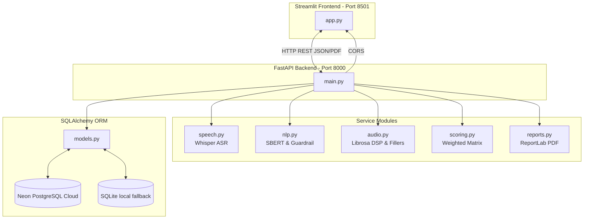

# 🎙️ SkillEcho — Voice-Based Concept Understanding Analyser (VBCUA)

[](https://www.python.org/)
[](https://fastapi.tiangolo.com/)
[](https://streamlit.io/)
[](https://neon.tech/)
[](LICENSE)

SkillEcho is an AI-powered voice evaluation platform designed to automate the assessment of spoken conceptual explanations. It leverages automatic speech recognition (ASR), natural language processing (NLP) semantic similarity models, and digital signal processing (DSP) acoustic feature extraction to compute an objective, multi-dimensional score of understanding.

Developed to comply with rigorous academic submission standards, the repository follows a modular **Domain-Driven Design (DDD)** directory layout and includes a complete SDLC documentation suite structured to match the strict evaluation rubric.

---

## 🌟 Key Features

*   **Secure User Management:** Role-based access control (RBAC) separating **Students** (evaluations, history) and **Admins** (concept CRUD, all-user reports) using SHA-256 password security.
*   **ASR Transcription Engine:** High-accuracy Speech-to-Text via a cached **OpenAI Whisper** model.
*   **Dual-Model Semantic Assessment:** Combines **Bi-Encoder** (`all-MiniLM-L6-v2`) for topic alignment and a **Cross-Encoder** (`ms-marco-MiniLM-L-6-v2`) for precise validation.
*   **Topic Guardrail:** Rapid vocabulary overlap filter that short-circuits evaluation on off-topic explanations, saving valuable computation.
*   **Vocal Acoustics & Fluency DSP:** Measures confidence and fluency using **Librosa** (RMS energy, pause/silence ratio, zero-crossing rate) and regex-based filler word statistics (tracking *um, uh, like, so, actually, basically*).
*   **Dynamic Scorecard & Visuals:** Live audio waveform charts and interactive score gauges rendered dynamically on the UI.
*   **In-Memory PDF Auditing:** Instant compilation of professional evaluation certificates using **ReportLab Platypus** with zero disk I/O latency.

---

## 🏗️ Domain-Driven Design (DDD) Architecture

SkillEcho isolates UI concerns from heavy ML pipelines and databases using a decoupled frontend/backend paradigm:



---

## 📂 Repository Structure

```
VBCUA/
├── .env                              # Database URL and environment configuration
├── .gitignore                        # Git exclusion rules (venv, caches, audios, PDFs)
├── LICENSE                           # MIT License
├── requirements.txt                  # Python dependencies manifest
├── packages.txt                      # System-level dependencies (ffmpeg)
├── run.sh                            # Unified services startup script
├── data/
│   ├── uploaded_audio/               # Persisted student WAV uploads (UUID-prefixed)
│   └── reference_materials/          # Admin-uploaded concept reference materials (PDFs)
├── docs/                             # Rubric-aligned SDLC documentation suite
│   ├── 1. Brainstorming & Ideation/
│   │   ├── Brainstorming_and_Idea_Prioritization.md
│   │   ├── Define_Problem_Statements.md
│   │   └── Empathy_Map.md
│   ├── 2. Requirement Analysis/
│   │   ├── Customer_Journey_Map.md
│   │   ├── Data_Flow_Diagram.md
│   │   ├── Solution_Requirements.md
│   │   └── Technology_Stack.md
│   ├── 3. Project Design Phase/
│   │   ├── Problem_Solution_Fit.md
│   │   ├── Proposed_Solution.md
│   │   └── Solution_Architecture.md
│   ├── 4. Project Planning Phase/
│   │   └── Project_Planning.md
│   ├── 5. Project Development Phase/
│   │   ├── Coding_and_Solution.md
│   │   ├── Code_Layout_Readability.md
│   │   └── Functional_Features.md
│   ├── 6.Project Testing/
│   │   └── Performance_Testing.md
│   ├── 7.Project Documentation/
│   │   └── Project_Executable_Files.md
│   └── 8.Project Demonstration/
│       ├── Communication.md
│       ├── Demonstration_of_Proposed_Features.md
│       ├── Project_Demo_Planning.md
│       ├── Scalability_and_Future_Plan.md
│       └── Team_Involvement.md
├── scripts/                          # Utility and maintenance scripts
└── src/                              # Source code root
    ├── frontend/
    │   └── app.py                    # Streamlit Presentation Layer (~1800 lines)
    └── backend/
        ├── api/
        │   └── main.py              # FastAPI Application Orchestration Layer (795 lines)
        ├── db/
        │   └── models.py            # SQLAlchemy ORM Data Layer (10 tables, 464 lines)
        └── services/                 # Domain Service Layer
            ├── speech.py            # Whisper Speech-to-Text module
            ├── nlp.py               # SBERT Semantic and Guardrail modules
            ├── audio.py             # Librosa Acoustic DSP and filler word parsing
            ├── scoring.py           # Evaluation matrix and tier categorization
            └── reports.py           # In-memory PDF report builder
```

---

## ⚙️ Local Installation & Setup

Follow these steps to deploy and run the application locally on your Linux machine:

### 1. Prerequisites

Ensure you have **Python 3.11** installed. You will also need **FFmpeg** on your host system for Whisper audio transcoding.
On Ubuntu/Debian:
```bash
sudo apt update && sudo apt install -y ffmpeg
```

### 2. Clone the Repository
```bash
git clone https://github.com/gummala-sandeep/ai-speech-evaluator.git
cd VBCUA
```

### 3. Create a Virtual Environment & Install Dependencies
```bash
python3.11 -m venv venv311
source venv311/bin/activate
pip install --upgrade pip
pip install -r requirements.txt
```

### 4. Configure Environment Variables
Create a `.env` file in the root directory and configure your `DATABASE_URL`.
```bash
# To run locally with SQLite:
DATABASE_URL=sqlite:///database.db

# To run with serverless PostgreSQL (Neon / Production):
# DATABASE_URL=postgresql://<user>:<password>@<host>/<database>?sslmode=require
```

### 5. Run the Application
The `run.sh` startup script automates environment validation, sets `PYTHONPATH` to ensure proper absolute imports across domains, and launches both services simultaneously:
```bash
bash run.sh
```

Upon boot:
*   **FastAPI Backend** will run on: `http://localhost:8000`
*   **FastAPI Interactive Swagger Docs** will be available at: `http://localhost:8000/docs`
*   **Streamlit Frontend** will run on: `http://localhost:8501`

---

## 🚀 The 10-Step AI Evaluation Pipeline

When a student submits an audio file to `/evaluate`, the system coordinates the following workflow:

1.  **Validate Concept:** Verifies that the targeted concept exists in the database.
2.  **Audio Ingestion:** Writes the uploaded WAV audio to the local cache with a collision-free UUID filename.
3.  **ORM Initialization:** Commits an `audio_files` entry in PostgreSQL marked as `processing`.
4.  **Whisper ASR:** Transcribes raw audio via Whisper `tiny` (forced English decoding, CPU-optimized).
5.  **Topic Guardrail:** Checks vocabulary keyword overlap against reference concepts. If off-topic, exits early with a score of `0` to save CPU resources.
6.  **Acoustic DSP:** Extracts RMS energy, Zero-Crossing Rate, and Pause/Silence ratio via Librosa.
7.  **Fluency Parsing:** Calculates filler word counts and rates using regex mapping.
8.  **Bi-Encoder Similarity:** Encodes transcript & reference texts into 384-dim embeddings to compute Cosine Similarity.
9.  **Cross-Encoder Accuracy:** Scores sentence-level alignment using joint cross-attention layers.
10. **Composite Scoring:** Combines all metrics using the evaluation matrix formula:
    $$\text{Score} = 0.25(\text{Bi-Enc}) + 0.25(\text{Cross-Enc}) + 0.20(\text{Filler Ratio}) + 0.15(\text{Pause Ratio}) + 0.15(\text{RMS Energy})$$
    The database records are then updated, and the in-memory PDF is prepared for download.

---

## 🗄️ Database Schema (10 Normalised Tables)

The database maintains strict referential integrity with cascading deletes across the following structure:

| Table | Entity Purpose | Key Mappings |
| :--- | :--- | :--- |
| `users` | Manages credential digests and RBAC roles. | `1:N` to `audio_files` and `sessions` |
| `audio_files` | Tracks ingestion status and metadata. | `1:1` to `transcripts` & `audio_features` |
| `transcripts` | Persists speech-to-text outputs. | `1:1` to `filler_word_stats` & `semantic_similarities` |
| `filler_word_stats` | Keeps record of vocal fluency metrics. | `N:1` (via transcript) to parent audio records |
| `audio_features` | Stores acoustic signal features. | `1:1` to parent `audio_files` |
| `reference_concepts` | Holds admin-uploaded material descriptions & PDFs. | `1:N` to evaluations and similarities |
| `semantic_similarities` | Persists Bi-Encoder and Cross-Encoder outputs. | `N:1` to transcripts and reference concepts |
| `evaluation_results` | Contains final composite scores and tier notes. | `1:1` to `reports` |
| `reports` | Manages paths to generated PDFs. | `1:1` to evaluation scorecards |
| `sessions` | Tracks student/admin session states. | `N:1` to user accounts |

---

## 🌐 Production Cloud Deployment

### Streamlit Community Cloud
1.  Verify `requirements.txt` and `packages.txt` are at the repository root (Streamlit reads `packages.txt` to install the system-level `ffmpeg` dependency).
2.  Deploy the repository from GitHub via the Streamlit dashboard, selecting `src/frontend/app.py` as the entry point.
3.  Set the `DATABASE_URL` secret in the cloud console to link the app to a hosted Neon PostgreSQL cluster.
